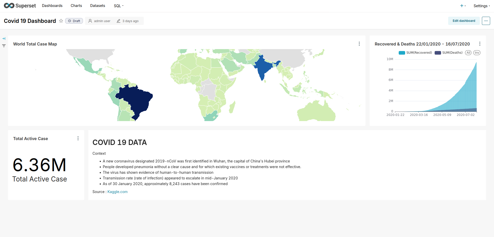

# Data Visualization Using Apache Superset

In this project I exploring apache-superset to exporting data to compatible superset source, and visualizing that. This project coverage :
- apache-superset installation.
- export CSV dataset to database.
- simple query and export as new dataset.
- visualizing dataset. 

__Note :__ _If you want to clone this project please ensure that you already create a PostgreSQL or MySQL database for currency_exchange dataset, and then export the dataset to those database. Alternatively, I already put the data from the database to ```currency_exchange.sql``` if you want to import it to your PostgreSQL._

## apache-superset Installation

Installing requirement :

```bash
    sudo yum install gcc \
                    gcc-c++ \
                    libffi-devel 
```

Installing apache-superset :

    pip install apache-superset

Exporting FLASK_APP variable :
```bash
    echo "#\!/usr/bin/sh \nexport FLASK_APP=superset\nexport SUPERSET_CONFIG_PATH=superset_config.py" > requirement.sh 
    source requirement.sh
```

preparing ```superset_config.py``` :

```python
import os

# Superset specific config
# ROW_LIMIT = 5000
ROW_LIMIT = 50000000
SAMPLES_ROW_LIMIT = 50000000
FILTER_SELECT_ROW_LIMIT = 50000000
QUERY_SEARCH_LIMIT = 50000000
SQL_MAX_ROW = 500000000
DISPLAY_MAX_ROW = 50000000
DEFAULT_SQLLAB_LIMIT = 50000000

# Flask App Builder configuration
# Your App secret key will be used for securely signing the session cookie
# and encrypting sensitive information on the database
# Make sure you are changing this key for your deployment with a strong key.
# Alternatively you can set it with `SUPERSET_SECRET_KEY` environment variable.
# You MUST set this for production environments or the server will refuse
# to start and you will see an error in the logs accordingly.
SECRET_KEY = 'iGJFOh24XJ3rFldSpvGXDHOcmMlATrJfdtjoJnBY6J9A6u6C9UPUDcFq'

# The SQLAlchemy connection string to your database backend
# This connection defines the path to the database that stores your
# superset metadata (slices, connections, tables, dashboards, ...).
# Note that the connection information to connect to the datasources
# you want to explore are managed directly in the web UI
# The check_same_thread=false property ensures the sqlite client does not attempt
# to enforce single-threaded access, which may be problematic in some edge cases
PWD = os.getcwd()
SQLALCHEMY_DATABASE_URI = 'sqlite:///'+os.path.join(PWD,'superset.db')+'?check_same_thread=false'
PREVENT_UNSAFE_DB_CONNECTIONS = False
TALISMAN_ENABLED= False

# Flask-WTF flag for CSRF
CSRF_ENABLED = False
WTF_CSRF_ENABLED = False

# Add endpoints that need to be exempt from CSRF protection
WTF_CSRF_EXEMPT_LIST = []
# A CSRF token that expires in 1 year
WTF_CSRF_TIME_LIMIT = 60 * 60 * 24 * 365

# Set this API key to enable Mapbox visualizations
MAPBOX_API_KEY = ''
```

These SECRET_KEY generated using :

```openssl rand -base64 42```

Upgrade db :

```superset db upgrade```

Run superset :

```superset run -p 8088 --with-threads --reload --debugger```

## Error Collection :

__Secret key error :__

```
--------------------------------------------------------------------------------
                                    WARNING
--------------------------------------------------------------------------------
A Default SECRET_KEY was detected, please use superset_config.py to override it.
Use a strong complex alphanumeric string and use a tool to help you generate 
a sufficiently random sequence, ex: openssl rand -base64 42 
For more info, see: https://superset.apache.org/docs/configuration/configuring-superset#specifying-a-secret_key
--------------------------------------------------------------------------------
--------------------------------------------------------------------------------
Refusing to start due to insecure SECRET_KEY
(env) 
```
__Solution :__

Generate token using this command :
```openssl rand -base64 42```

---

__Incompatible marshmallow version :__

```
TypeError: Field.__init__() got an unexpected keyword argument 'minLength
```

__solution :__
```
pip uninstall marshmallow #version 4.0.0 incompatible
pip install marshmallow==3.26.1
```

---

__Uncreated table ab_user :__
```
sqlalchemy.exc.NoSuchTableError: ab_user superset
```

__Solution :__

Using absolute path to DB uri in superset_config.py, teherefore we are get this line of code to get current path :

```python
PWD = os.getcwd()
SQLALCHEMY_DATABASE_URI = 'sqlite:///'+os.path.join(PWD,'superset.db')+'?check_same_thread=false'
```

---

__User not found :__

login fail using admin:admin

__solution :__

create superset admin user :
```superset fab create-admin```

---

__SQLite error :__

When we will exporting large dataset from CSV to SQLite database, will generating some error because SQLite unsuported large data with lot of row. The solution is using more resilience database such as PostgresQL and MySQL.

__Solution :__

In this case I using PostgreSQL as a database :
```sql
CREATE DATABASE superset;
CREATE USER superset WITH ENCRYPTED PASSWORD 'superset';
GRANT ALL PRIVILEGES ON DATABASE superset TO superset;
\c superset;
GRANT ALL PRIVILEGES ON SCHEMA public TO superset;
```
---

## Visualization Project 

### Stock Market June 2025


- data source : [kaggle.com](https://www.kaggle.com/datasets/pratyushpuri/stock-market-june-2025-dataset?select=stock_market_june2025.csv)
- visualizing top 10 cap market in 01/06/2025 using query and save it as new dataset.
- visualizing sector in 01/06/2025 and the most industry are material industry.
- Visualizing all data as table.

### Currency Exchange Rate

- data source : [kaggle.com](https://www.kaggle.com/datasets/thebasss/currency-exchange-rates)
- Popular currency exchange from 1998 - 2018.
- Popular currency exchange from 2015 to 2018.
- comparison 3 strongest currency change.

### Covid 19

- data source : [Kaggle.com](https://www.kaggle.com/datasets/imdevskp/corona-virus-report/data)
- World map of Covid distribution darker the colour indicate higher active covid case.
- Recovered and deaths case in early covid pandemic.
- Total active case in end of date from dataset.
